# Fundi Connect

**Fundi Connect** is a Flutter marketplace app that connects clients with verified
tradesmen (fundis) in Rwanda. Clients discover tradesmen by trade and price,
book jobs with a date, time and location, and pay by mobile money. Tradesmen
manage incoming requests, track their earnings, and build a public reputation
through client reviews and star ratings.

The app has two role-based experiences behind a single account:

- **Client** — browse tradesmen, book, pay, cancel, and rate completed jobs.
- **Tradesman** — accept/decline requests, mark jobs completed, track earnings
  and ratings, and manage a public profile with portfolio photos.

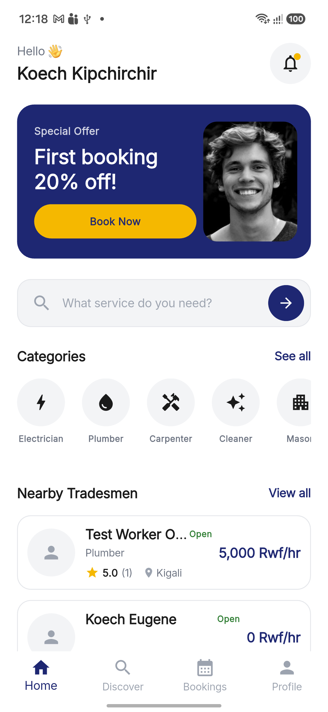

---

## Table of contents

- [Features](#features)
- [Screenshots](#screenshots)
- [Tech stack](#tech-stack)
- [Getting started](#getting-started)
  - [Prerequisites](#prerequisites)
  - [1. Firebase project setup](#1-firebase-project-setup)
  - [2. Configure the app](#2-configure-the-app)
  - [3. Run the app](#3-run-the-app)
- [Firestore rules & indexes](#firestore-rules--indexes)
- [Project structure](#project-structure)
- [Tests](#tests)
- [License](#license)

---

## Features

### Client
- Onboarding, email/password **and Google sign-in**, email verification
- Home screen with a welcome banner, trade categories and nearby tradesmen
- Discover tradesmen with filters (category, top rated, price, availability)
- Worker profiles with portfolio, hourly rate, reviews and ratings
- Book a job: pick a service type, date, time and location, see the price
  estimate (service + platform fee), pay with **MTN MoMo / Airtel Money / Cash**
- Live booking status: waiting → accepted → completed / declined / cancelled
- Cancel upcoming bookings, review completed jobs once (stars + comment),
  and see "Reviews You Have Written" on the profile

### Tradesman
- Incoming request list with client details, price and location
- **Accept / Decline** requests, **Mark as Completed** when the job is done
- Dashboard: today/weekly/monthly earnings, average rating, jobs completed
- Public profile: category, hourly rate, district, bio, portfolio photos,
  availability toggle ("Accepting bookings")
- See all reviews received on the profile

### Reviews & ratings
- One review per completed booking — server-enforced (Firestore transaction +
  security rules), so ratings cannot be gamed or edited after posting
- Rating aggregates (`ratingAvg`, `reviewCount`) update on the worker in the
  same transaction and are shown across Discover, worker profiles and the
  tradesman dashboard

---

## Screenshots

### Authentication & onboarding

| Onboarding | Sign in |
| :---: | :---: |
| 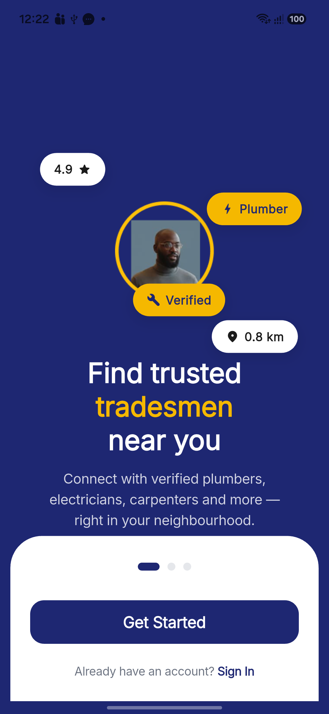 | 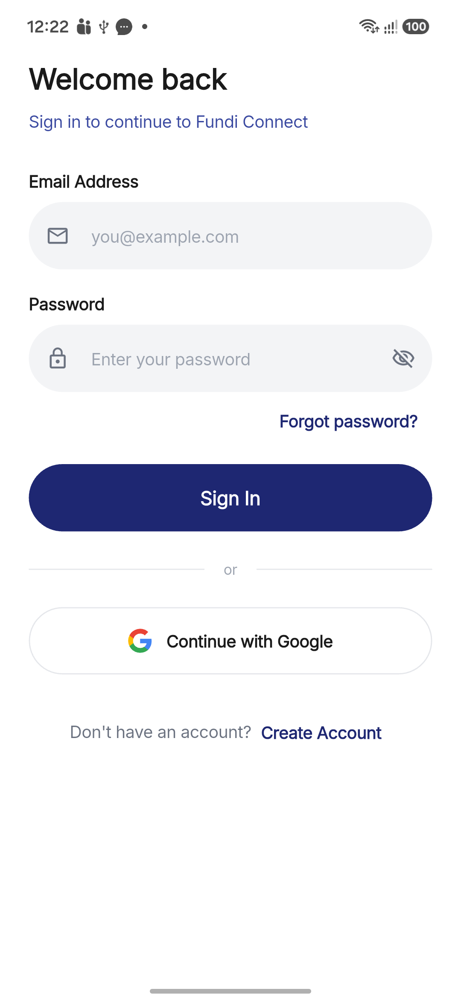 |

### Client experience

| Client home | Discover tradesmen |
| :---: | :---: |
|  | 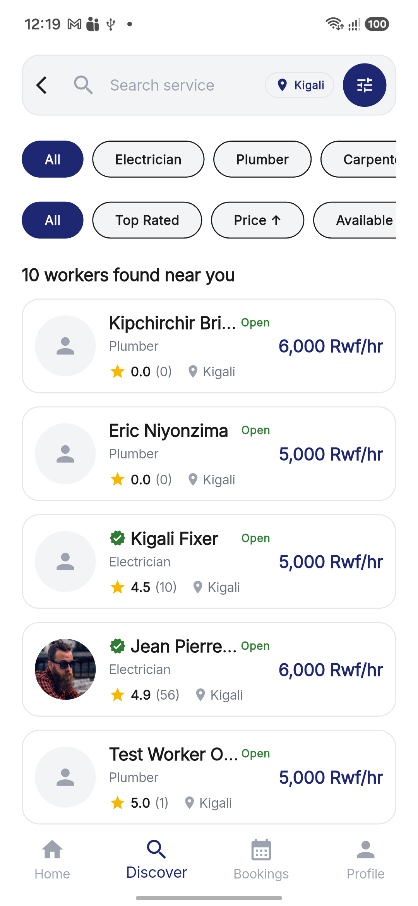 |

| Worker profile | Worker reviews |
| :---: | :---: |
| 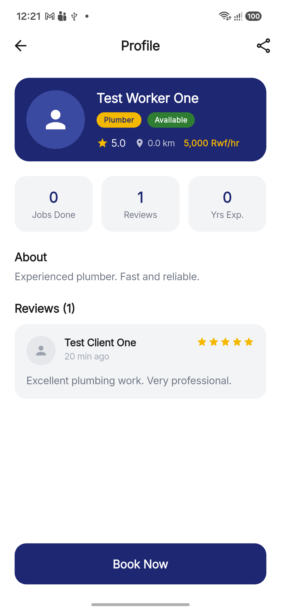 |  |

| Confirm booking | Booking details |
| :---: | :---: |
| 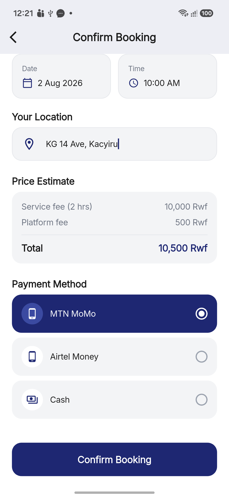 | 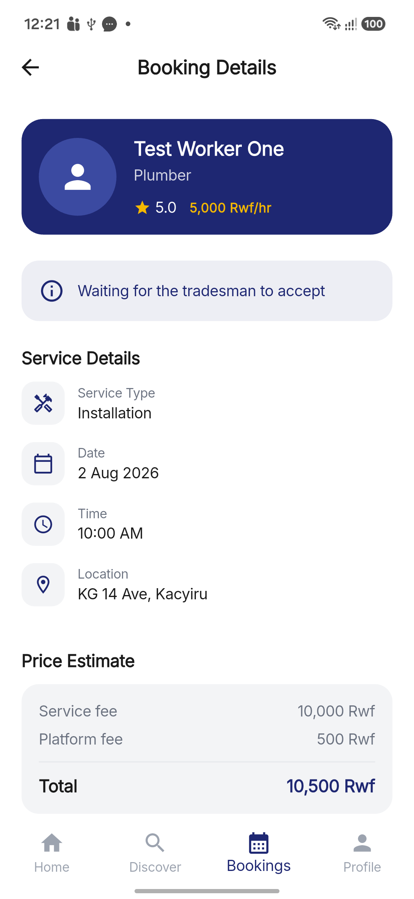 |

| My bookings | Client profile & reviews written |
| :---: | :---: |
| 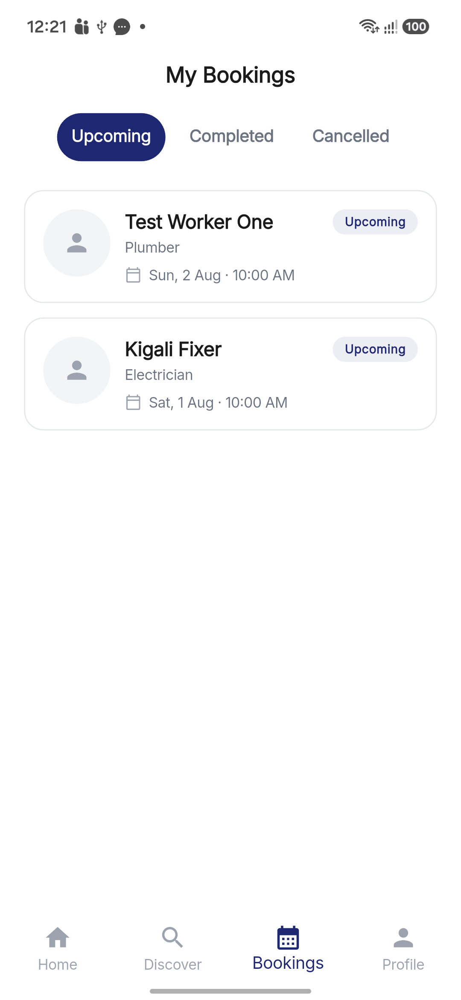 | 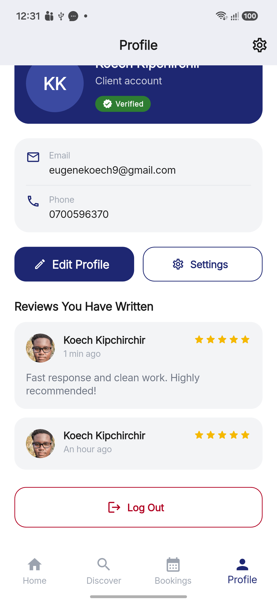 |

| Settings |
| :---: |
| 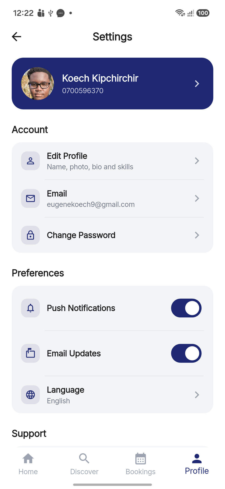 |

### Tradesman experience

| Tradesman home & incoming requests | Job request (accept/decline) |
| :---: | :---: |
| 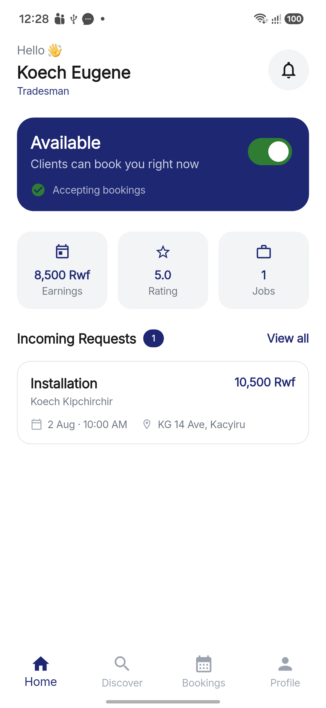 | 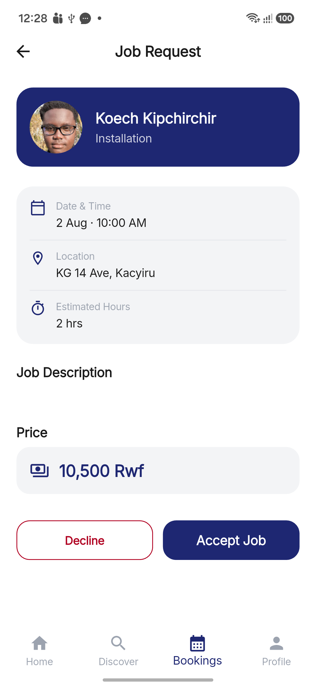 |

| My jobs | Mark as completed |
| :---: | :---: |
| 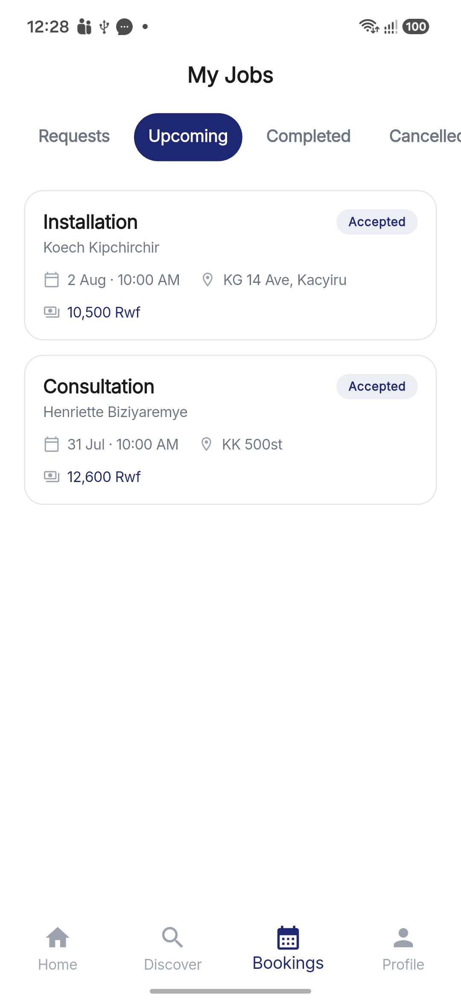 | 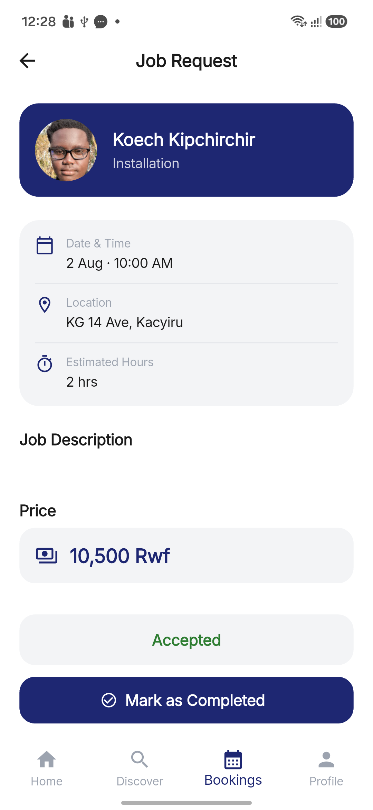 |

| Tradesman profile & reviews | Edit profile |
| :---: | :---: |
| 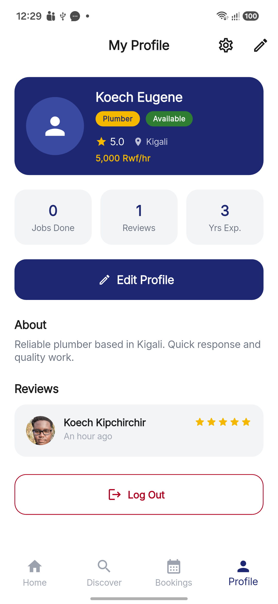 | 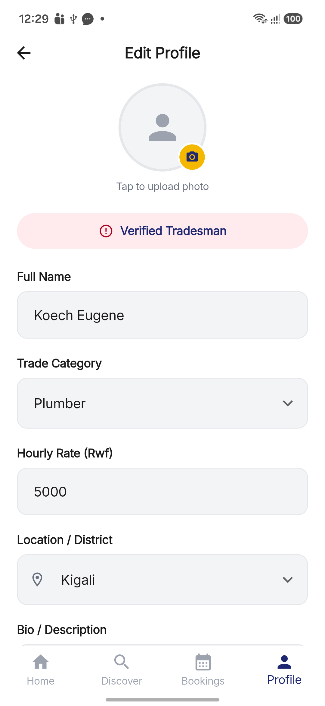 |

### Reviews & ratings flow

| Rate a completed job | Posted review on the booking |
| :---: | :---: |
| 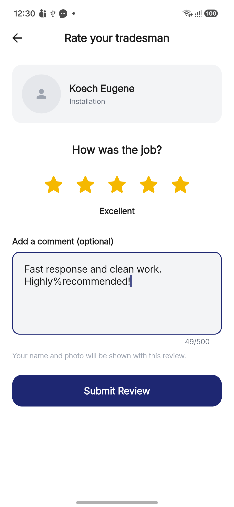 | 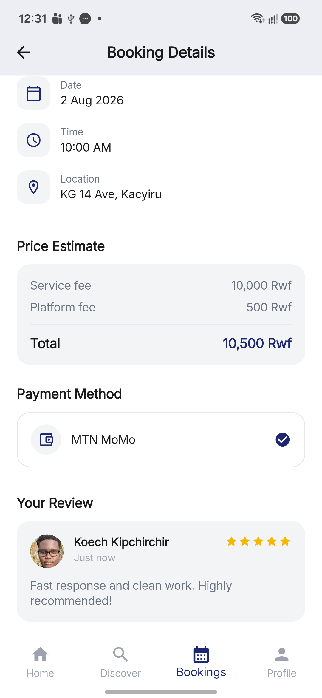 |

---

## Tech stack

- **Flutter** (Dart) — single codebase for Android / iOS / web
- **Firebase Authentication** — email/password + Google sign-in
- **Cloud Firestore** — users, workers, bookings, reviews, categories
- **Firebase Storage** — profile photos and portfolio images
- **Riverpod** — state management
- **go_router** — declarative routing with role-based guards
- **Firebase Security Rules** — server-side validation of bookings and reviews

---

## Getting started

### Prerequisites

- **Flutter SDK** 3.44+ (`flutter doctor` should pass for Android)
- **Android Studio** / Android SDK (API 34+)
- **Firebase CLI** (`npm install -g firebase-tools`) and a Firebase account
- A **physical Android device** (recommended, e.g. via `adb`) or an emulator

### 1. Firebase project setup

The app expects a Firebase project named `fundi-connect-af6ff` with the
following enabled:

1. Create the project at [Firebase console](https://console.firebase.google.com/).
2. **Authentication** → Sign-in method:
   - enable **Email/Password**
   - enable **Google** and add the SHA-1 (and SHA-256) fingerprint of your
     signing keystore so Google Sign-In works on debug builds:
     ```bash
     cd android && ./gradlew signingReport
     ```
3. **Firestore Database** — create the database in **production mode** and
   deploy the rules and indexes from this repository:
   ```bash
   firebase deploy --only firestore:rules
   firebase deploy --only firestore:indexes
   ```
   > These are required: the app uses composite indexes for worker lists,
   > booking streams and review feeds (see `firestore.indexes.json`).
4. **Storage** — create the default bucket (used for profile photos).
5. Register your app: **Android** package `com.example.fundi_connect`, download
   the generated `google-services.json` and place it at `android/app/`.

### 2. Configure the app

```bash
flutter pub get
```

Make sure `android/app/google-services.json` exists (step 1.5). The Flutter
Firebase plugins read their configuration from it automatically.

### 3. Run the app

```bash
# Run on a connected device / emulator
flutter run

# Or build and install on a physical device with adb
flutter build apk --debug
adb install -r build/app/outputs/flutter-apk/app-debug.apk
adb shell am start -n com.example.fundi_connect/.MainActivity
```

Open the app, tap **Get Started**, choose **I need a tradesman** or
**I am a tradesman**, and create an account. Verify the email link sent to your
inbox (new accounts are gated until the email is verified).

> **Demo data:** the Firestore project is seeded with sample tradesmen and
> categories so Discover works immediately after sign-in.

---

## Firestore rules & indexes

The security rules live in [`firestore.rules`](firestore.rules) and mirror the
app's invariants server-side:

- bookings are visible only to the client and tradesman on the job
- only the client who made the booking can cancel it
- a review is accepted **only** when the booking is `completed`, belongs to the
  reviewer, and has not been rated yet — reviews are immutable afterwards
- the worker `ratingAvg`/`reviewCount` fields may only change in a way
  consistent with adding exactly one review

Composite indexes are declared in [`firestore.indexes.json`](firestore.indexes.json)
(worker filters/sorts, booking streams, review feeds).

---

## Project structure

```
lib/
├── config/            # routes, theme
├── core/              # models (user, worker, booking, review), shared widgets
├── features/
│   ├── auth/          # sign in / sign up, role selection, email verification
│   ├── client/
│   │   ├── home/      # client home
│   │   ├── discover/  # worker discovery + worker detail
│   │   ├── bookings/  # confirm booking, booking detail, bookings list
│   │   └── profile/   # client profile, settings
│   ├── tradesman/
│   │   ├── home/      # tradesman home, availability toggle
│   │   ├── bookings/  # job requests, accept/decline/complete
│   │   ├── dashboard/ # earnings & rating dashboard
│   │   └── profile/   # tradesman profile, edit profile
│   └── reviews/       # leave review, review card, rating math, providers
└── main.dart
```


## Tests

```bash
flutter analyze
flutter test
```

The suite covers auth validators, booking lifecycle, the reviews/ratings flow
(model, repository guard, rating math, leave-review screen), worker detail and
discover providers.

---


